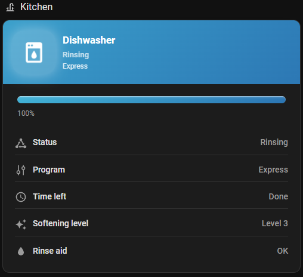
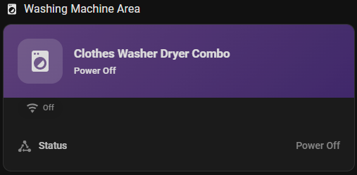

<div align="center">
  <h1>LG ThinQ Lovelace Cards</h1>
  <p>Zero-config Home Assistant cards for LG ThinQ appliances with live progress, smart chips, and polished gradients.</p>
  
  <a href="https://www.buymeacoffee.com/trusmith" target="_blank"></a>
</div>

> **⚠️ Beta Software**: This project is in active development. Minor issues may occur. If you encounter any problems, please [open an issue](https://github.com/john-lazarus/HomeAssistantLGThinkQCards/issues).

## Screenshots

<div align="center">
  
  
</div>

## What you get

- Auto-detect entities per appliance (washer, dryer, dishwasher, combo, mini, fridge); manual overrides optional.
- Responsive hero header with gradient accent, status + cycle labels, and animated progress bar.
- Contextual chips for door state, remote start, express modes, rinse refill, and more.
- Detail sections with duration formatting, unit-aware temperatures, and grouped measurements.
- Packaged for [HACS](https://hacs.xyz/) so the bundle updates alongside your other frontend cards.

## Install via HACS

<div align="center">
  <a href="https://my.home-assistant.io/redirect/hacs_repository/?owner=john-lazarus&repository=HomeAssistantLGThinkQCards&category=plugin"></a>
</div>

1. Click the blue **Install in HACS** button above or open `https://my.home-assistant.io/redirect/hacs_repository/?owner=john-lazarus&repository=HomeAssistantLGThinkQCards&category=plugin`.
2. When Home Assistant opens, confirm HACS is installed and logged in, then select **Open link**.
3. Choose **Download** inside HACS; keep the resource URL set to `/hacsfiles/HomeAssistantLGThinkQCards/homeassistant-lg-thinq-cards.js`.
4. After the download completes, click **Reload** so the new resources register.
5. Hard-refresh your browser (`Ctrl+F5` / `Cmd+Shift+R`) to ensure the updated bundle loads.

## Quick start

1. Install the official [LG ThinQ](https://www.home-assistant.io/integrations/lg_thinq/) integration and confirm your washer/dryer/etc. entities show up in **Developer Tools → States**.
2. Install the card through HACS either by using the **Install in HACS** button above or via **HACS → Frontend** and searching for “LG ThinQ cards.”
3. Confirm HACS auto-added the resource. If not, add it manually under `Settings → Dashboards → Resources` with URL `/hacsfiles/HomeAssistantLGThinkQCards/homeassistant-lg-thinq-cards.js` (type `module`).
4. Force-refresh your browser (`Ctrl+F5` / `Cmd+Shift+R`) so the latest bundle loads.
5. In Lovelace, add a **Manual** card with:

  ```yaml
  type: custom:lg-thinq-card
  ```

That's it—the card finds the best-matching appliance automatically. To lock it to a specific unit or override guesses, pass `appliance:` or provide explicit entity IDs.

**Note**: If your entities use a custom prefix (e.g., `sensor.jnj_washerdryer_*` instead of `sensor.washer_*`), you must specify the `entity_prefix`:

```yaml
type: custom:lg-thinq-card
appliance: washer_combo
entity_prefix: jnj_washerdryer
```

Or override individual entities:

```yaml
type: custom:lg-thinq-card
appliance: washer
entities:
  remaining_time: sensor.laundry_washer_time_display
  door: binary_sensor.laundry_washer_door
```

### Manual installation

1. Copy `homeassistant-lg-thinq-cards.js` into `<config>/www/community/homeassistant-lg-thinq-cards/`.
2. Add a Lovelace resource (type `module`) pointing to `/local/community/homeassistant-lg-thinq-cards/homeassistant-lg-thinq-cards.js`.
3. Reload the browser, then add the manual card snippet above.

### Troubleshooting checklist

- Resource missing? Visit `https://<ha-host>/hacsfiles/HomeAssistantLGThinkQCards/homeassistant-lg-thinq-cards.js`—you should see the bundle source.
- Still cached? Append `?v=0.5.0` to the resource URL or hard-reload the browser.
- Wrong entity match? Pass `appliance: washer` (etc.) or override specific sensors under `entities:`.

## Features in depth

- **Entity resolver**: Derives the entity prefix from ThinQ naming patterns (`sensor.washer_remaining_time`, etc.) so most setups work without configuration.
- **Progress logic**: Reads percentage, total time, or remaining time—falling back gracefully—and shows a friendly `xh ym left` label.
- **State chips**: Highlights only meaningful states; inactive chips collapse when marked `hideInactive` to keep the layout tidy.
- **Detail sections**: Optional metrics (like delay start or filters) only render when available; temperatures and numbers retain Home Assistant units.

## Development & testing

- `dist/homeassistant-lg-thinq-cards.js` contains the published bundle. Run `node --check dist/homeassistant-lg-thinq-cards.js` after edits to confirm syntax.
- `homeassistant-lg-thinq-cards.js` mirrors the bundle so HACS and manual installs share a single entry point.

## Roadmap

- Translations using Home Assistant frontend i18n utilities.
- Optional compact layout tuned for mobile dashboards.
- Additional appliance definitions as LG expands ThinQ coverage.

## Credits

- Original ThinQ inspiration and community research by the Home Assistant community and LG ThinQ integration maintainers.
- Iconography from [Material Design Icons](https://materialdesignicons.com/), used under their permissive license.
- Project maintained by John Lazarus under the [MIT License](LICENSE).

Contributions, bug reports, and screenshots of your dashboards are welcome!
